# Second Brain AI — Architecture Document

> **Audience:** Developers, backend engineers, AI engineers, and new team members.
> **Goal:** Understand how the system is built, how data flows through it, and why key decisions were made.

---

## Table of Contents

1. [Application Overview](#1-application-overview)
2. [Technology Stack](#2-technology-stack)
3. [High-Level Architecture](#3-high-level-architecture)
4. [Folder Structure](#4-folder-structure)
5. [Core Components](#5-core-components)
6. [Authentication Flow](#6-authentication-flow)
7. [Document Upload & Processing Flow](#7-document-upload--processing-flow)
8. [AI Chat & RAG Pipeline](#8-ai-chat--rag-pipeline)
9. [API Reference](#9-api-reference)
10. [Database Design](#10-database-design)
11. [Background Worker & Queue](#11-background-worker--queue)
12. [Deployment Architecture](#12-deployment-architecture)
13. [CI/CD Workflow](#13-cicd-workflow)
14. [Scalability & Security](#14-scalability--security)
15. [Engineering Decisions & Trade-offs](#15-engineering-decisions--trade-offs)

---

## 1. Application Overview

**Second Brain AI** is a personal knowledge base where users upload documents (PDFs, images, text files) and then chat with an AI assistant that answers questions grounded in those documents.

**Core user journey:**
1. Sign up / log in
2. Upload documents (PDF, image, audio, text)
3. Documents are processed in the background — text extracted, chunked, and stored as vector embeddings
4. Ask questions in the chat panel — the AI retrieves relevant chunks and synthesizes a cited answer

**Key architectural pattern:** [RAG — Retrieval Augmented Generation](https://en.wikipedia.org/wiki/Retrieval-augmented_generation). The LLM never hallucinates from general knowledge alone; it always searches the user's own documents first.

---

## 2. Technology Stack

| Layer | Technology | Purpose |
|---|---|---|
| **Frontend** | React 19 + Vite | SPA UI |
| **Routing** | react-router-dom v7 | Client-side routing |
| **HTTP Client** | Axios | API calls from browser |
| **Markdown Rendering** | react-markdown + remark-gfm | Render AI responses |
| **Backend** | Node.js + Express 5 | REST API server |
| **Auth** | JSON Web Tokens (JWT) + bcrypt | Stateless auth + password hashing |
| **Application DB** | MongoDB + Mongoose | Users, Documents metadata |
| **Vector DB** | Weaviate | Semantic search over document chunks |
| **File Storage** | AWS S3 | Raw file storage |
| **Message Queue** | AWS SQS + sqs-consumer | Async document processing |
| **OCR (images)** | AWS Textract | Extract text from images |
| **PDF parsing** | pdf-parse | Extract text from PDFs |
| **Embeddings** | OpenAI `text-embedding-3-small` | Convert text to vectors |
| **LLM** | OpenAI `gpt-4o-mini` | Chat, query rewriting, reranking |
| **Containerisation** | Docker + Docker Compose | Local MongoDB & Weaviate |

---

## 3. High-Level Architecture
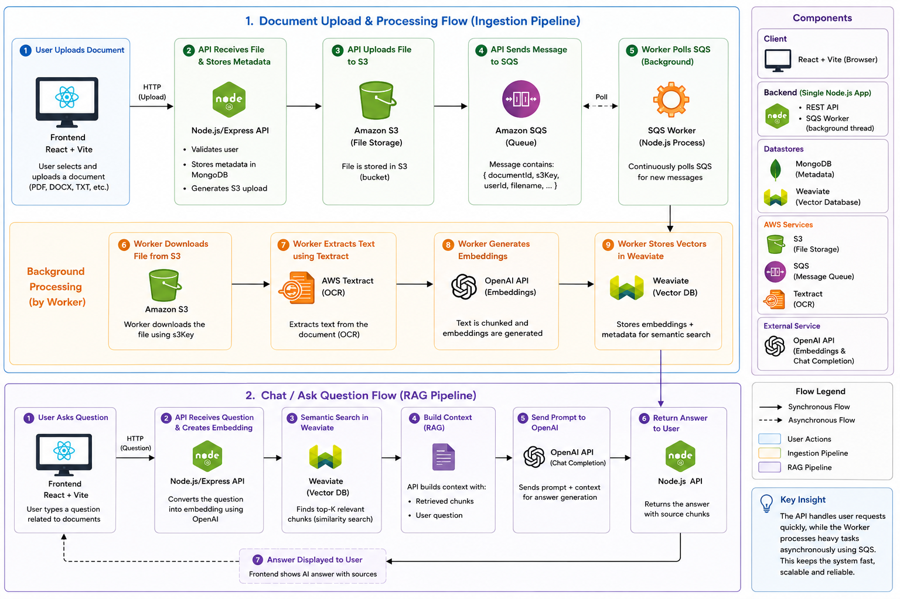
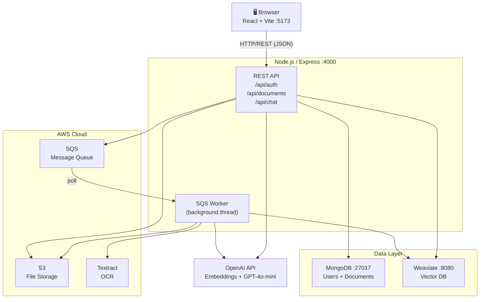

**Key insight:** The backend runs as a **single Node.js process** that simultaneously serves the REST API and runs the SQS consumer worker. This is fine for a monolith/dev setup; in production you'd split them.

---

## 4. Folder Structure

```
SecondBrain/
├── docker-compose.yml         # Spins up MongoDB + Weaviate locally
├── backend/
│   ├── package.json
│   └── src/
│       ├── server.js          # Entry point — boots DB connections + HTTP server + worker
│       ├── app.js             # Express app, CORS, routes registration
│       ├── controllers/       # Request handlers (thin layer, delegates to services)
│       │   ├── auth.controller.js
│       │   ├── document.controller.js
│       │   └── chat.controller.js
│       ├── routes/            # Route definitions and middleware wiring
│       │   ├── auth.routes.js
│       │   ├── document.routes.js
│       │   └── chat.routes.js
│       ├── middleware/
│       │   └── auth.middleware.js  # JWT verification
│       ├── models/            # Mongoose schemas
│       │   ├── User.js
│       │   └── Document.js
│       ├── db/
│       │   ├── mongoose.js    # MongoDB connection
│       │   └── weaviate.js    # Weaviate connection + schema init
│       ├── services/          # Business logic (each file = one external concern)
│       │   ├── s3.service.js
│       │   ├── sqs.service.js
│       │   ├── embeddings.service.js
│       │   ├── vector.service.js   # Weaviate CRUD
│       │   ├── agent.service.js    # Agentic RAG orchestrator
│       │   └── reranker.service.js # Hybrid reranker
│       ├── workers/
│       │   └── processor.js   # SQS message consumer
│       └── utils/
│           └── chunker.js     # Text chunking utility
└── frontend/
    ├── package.json
    ├── vite.config.js
    └── src/
        ├── main.jsx           # React entry point, wraps app in AuthProvider
        ├── App.jsx            # Router + ProtectedRoute guard
        ├── context/
        │   └── AuthContext.jsx  # Global auth state, token management
        ├── pages/
        │   ├── Login.jsx
        │   ├── Signup.jsx
        │   └── Dashboard.jsx    # Document list + upload zone + chat sidebar
        └── components/
            └── ChatInterface.jsx # Chat UI + citation rendering
```

**Pattern used:** Controllers are thin — they validate input and delegate to services. Services own all business logic and external API calls. This makes services independently testable.

---

## 5. Core Components

### Backend

| Component | File | Responsibility |
|---|---|---|
| HTTP Server | `server.js` | Boot sequence: MongoDB → Weaviate → Worker → Listen |
| Express App | `app.js` | CORS, JSON parsing, route mounting |
| Auth Middleware | `auth.middleware.js` | Verify JWT on protected routes |
| S3 Service | `s3.service.js` | Upload files, generate presigned URLs |
| SQS Service | `sqs.service.js` | Enqueue processing jobs |
| Embeddings Service | `embeddings.service.js` | Call OpenAI embedding API |
| Vector Service | `vector.service.js` | Weaviate upsert, search, delete |
| Agent Service | `agent.service.js` | Orchestrate RAG: rewrite → embed → search → rerank → answer |
| Reranker Service | `reranker.service.js` | Hybrid LLM + vector score reranking |
| Processor Worker | `workers/processor.js` | SQS consumer: download → extract → chunk → embed → store |
| Text Chunker | `utils/chunker.js` | Split text into overlapping word windows |

### Frontend

| Component | Responsibility |
|---|---|
| `AuthContext.jsx` | Stores JWT in localStorage, exposes `login`, `signup`, `logout`, sets Axios default headers |
| `App.jsx` | Routing + `ProtectedRoute` (redirects unauthenticated users to `/login`) |
| `Dashboard.jsx` | Document grid with drag-and-drop upload, polls `/api/documents` every 5s for status updates |
| `ChatInterface.jsx` | Chat UI with full message history, citation chips, markdown rendering |

---

## 6. Authentication Flow

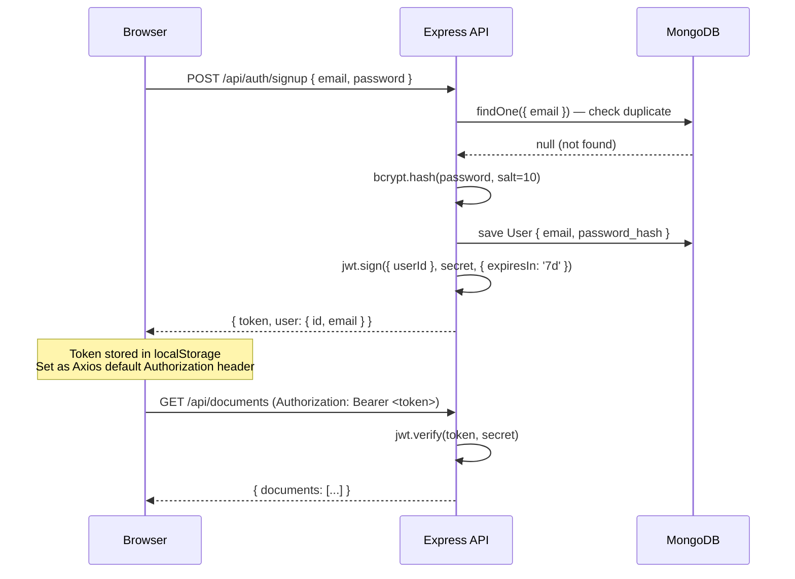

**How it works:**
- Passwords are hashed with **bcrypt** (salt rounds = 10) before storage — the plaintext password never touches the database.
- On login/signup the server issues a **JWT** that expires in **7 days**.
- The frontend stores the token in `localStorage` and injects it into every Axios request via `axios.defaults.headers.common['Authorization']`.
- The `authenticate` middleware on every protected route verifies the JWT signature and extracts `userId` into `req.user`.

---

## 7. Document Upload & Processing Flow
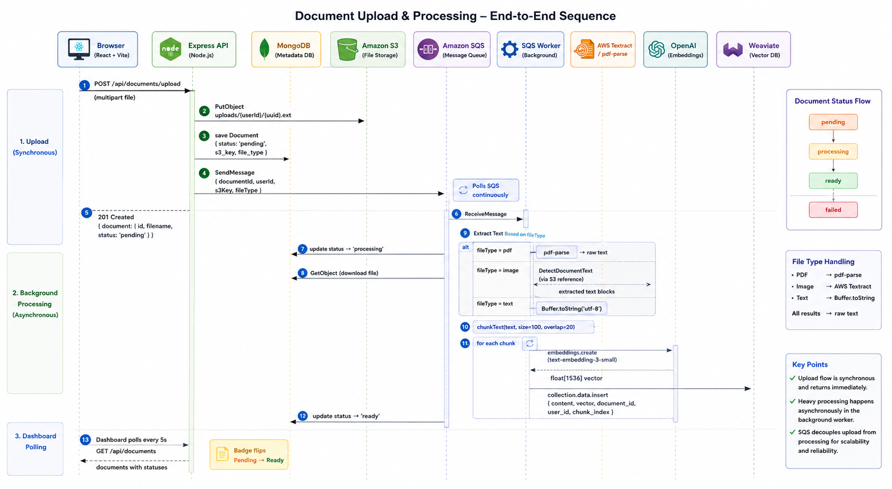
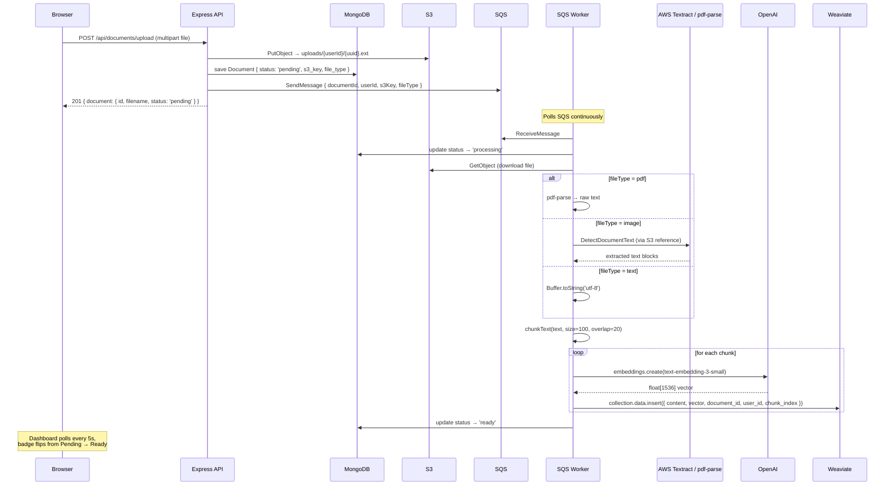

**Document statuses:** `pending` → `processing` → `ready` | `failed`

---

## 8. AI Chat & RAG Pipeline
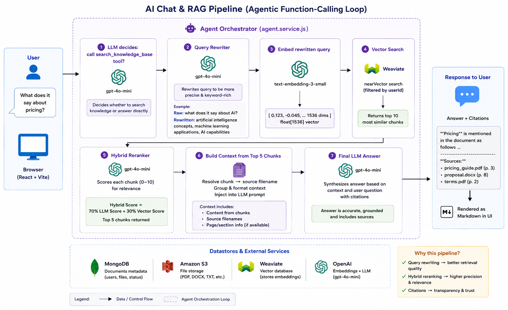
This is the most important part of the system. When a user asks a question, the backend uses an **agentic function-calling loop** with a 4-stage RAG pipeline.

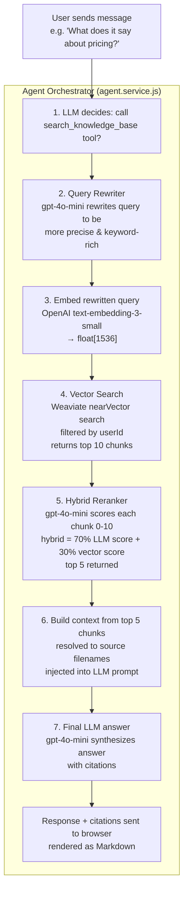

**Why query rewriting?** Raw user questions like "what does it say about AI?" are vague. Rewriting them to "artificial intelligence concepts, machine learning applications, AI capabilities" produces much better vector similarity matches.

**Why hybrid reranking?** Vector similarity alone can surface off-topic chunks. The LLM reranker acts as a cross-encoder — it reads both query and chunk together and scores relevance precisely. The hybrid formula (70% LLM + 30% vector) blends the two signals.

---

## 9. API Reference

All protected endpoints require `Authorization: Bearer <token>` header.

### Auth

| Method | Path | Auth | Body | Response |
|---|---|---|---|---|
| POST | `/api/auth/signup` | No | `{ email, password }` | `{ token, user }` |
| POST | `/api/auth/login` | No | `{ email, password }` | `{ token, user }` |

### Documents

| Method | Path | Auth | Body | Response |
|---|---|---|---|---|
| POST | `/api/documents/upload` | Yes | `multipart/form-data: file` (max 50MB) | `{ document }` |
| GET | `/api/documents` | Yes | — | `{ documents: [...] }` |
| GET | `/api/documents/:id/url` | Yes | — | `{ url }` (presigned S3 URL, 15 min TTL) |
| DELETE | `/api/documents/:id` | Yes | — | `{ message }` |

### Chat

| Method | Path | Auth | Body | Response |
|---|---|---|---|---|
| POST | `/api/chat` | Yes | `{ message, history[] }` | `{ role, content, citations[] }` |

### Health

| Method | Path | Response |
|---|---|---|
| GET | `/health` | `{ status: 'ok' }` |

---

## 10. Database Design
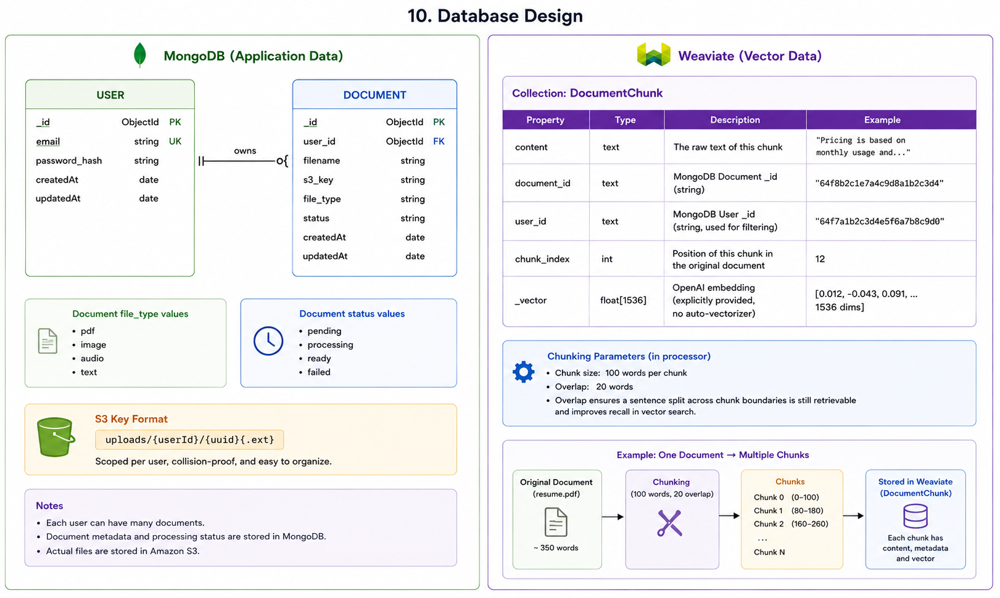
### MongoDB (Application Data)

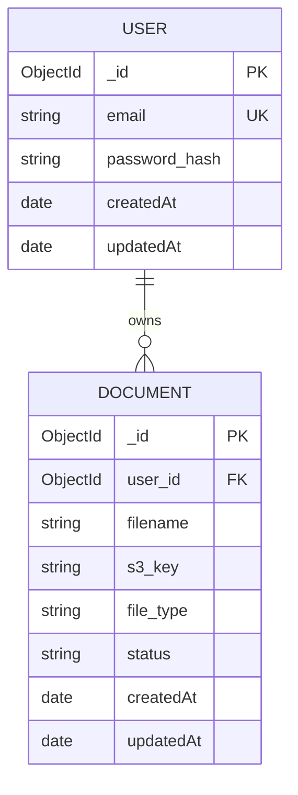

**Document `file_type` values:** `pdf` | `image` | `audio` | `text`
**Document `status` values:** `pending` | `processing` | `ready` | `failed`

**S3 key format:** `uploads/{userId}/{uuid}{.ext}` — scoped per user, collision-proof.

### Weaviate (Vector Data)

Collection: `DocumentChunk`

| Property | Type | Description |
|---|---|---|
| `content` | text | The raw text of this chunk |
| `document_id` | text | MongoDB Document `_id` (string) |
| `user_id` | text | MongoDB User `_id` (string, used for filtering) |
| `chunk_index` | int | Position of this chunk in the original document |
| `_vector` | float[1536] | OpenAI embedding (explicitly provided, no auto-vectorizer) |

**Chunking parameters (in processor):** 100 words per chunk, 20 word overlap. Overlap ensures a sentence split across chunk boundaries is still retrievable.

---

## 11. Background Worker & Queue
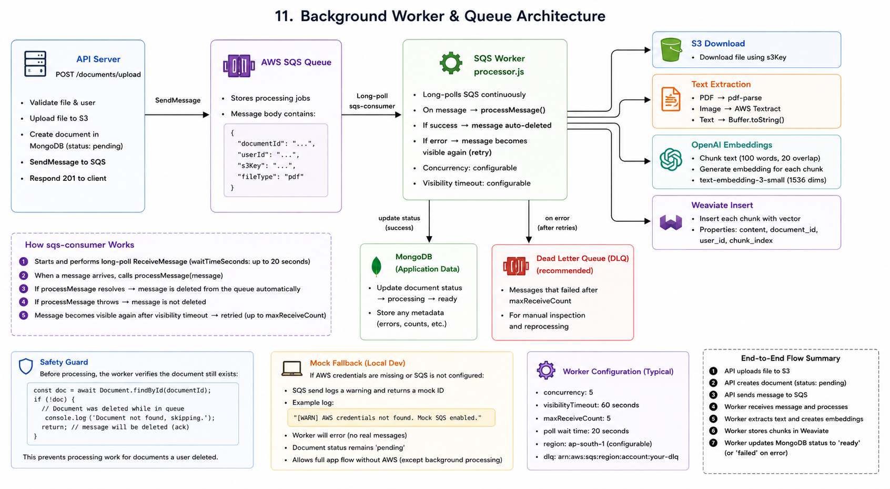
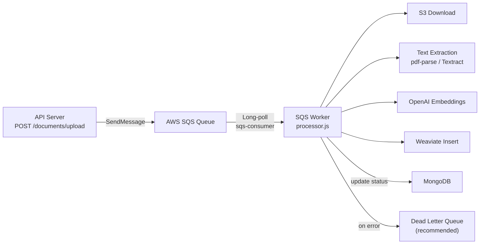

**How sqs-consumer works:** It long-polls SQS, calling `ReceiveMessage` in a loop. When a message arrives, it calls `processMessage()`. If the function resolves, the message is deleted from the queue automatically. If it throws, the message becomes visible again for retry.

**Safety guard:** The worker checks if the MongoDB document still exists before processing — handles the case where a user deletes a document while it's still queued.

**Mock fallback:** If AWS credentials are missing (local dev), the SQS send logs a warning and returns a mock ID. The worker will error silently but document status will stay `pending`.

---

## 12. Deployment Architecture
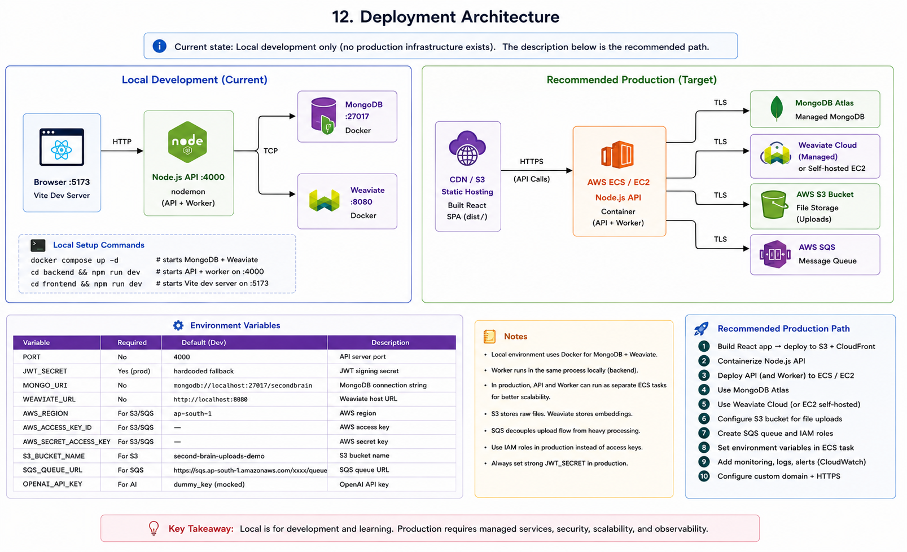
> **Current state:** Local development only (no production infrastructure exists). The description below is the recommended path.

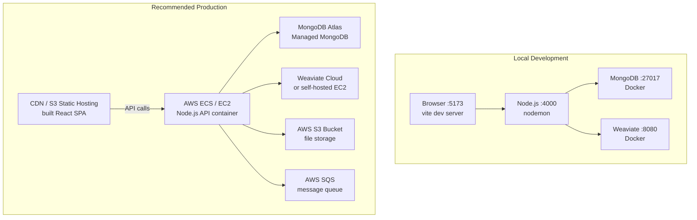

**Local setup:**
```bash
docker compose up -d          # starts MongoDB + Weaviate
cd backend && npm run dev      # starts API + worker on :4000
cd frontend && npm run dev     # starts Vite dev server on :5173
```

**Environment variables required:**

| Variable | Required | Default | Description |
|---|---|---|---|
| `PORT` | No | `4000` | API server port |
| `JWT_SECRET` | Yes (prod) | hardcoded fallback | JWT signing secret |
| `MONGO_URI` | No | `mongodb://localhost:27017/secondbrain` | MongoDB connection string |
| `WEAVIATE_URL` | No | `http://localhost:8080` | Weaviate host |
| `AWS_REGION` | For S3/SQS | `ap-south-1` | AWS region |
| `AWS_ACCESS_KEY_ID` | For S3/SQS | — | AWS credentials |
| `AWS_SECRET_ACCESS_KEY` | For S3/SQS | — | AWS credentials |
| `S3_BUCKET_NAME` | For S3 | `second-brain-uploads-demo` | S3 bucket |
| `SQS_QUEUE_URL` | For SQS | placeholder URL | SQS queue URL |
| `OPENAI_API_KEY` | For AI | `dummy_key` (mocked) | OpenAI API key |

---

## 13. CI/CD Workflow
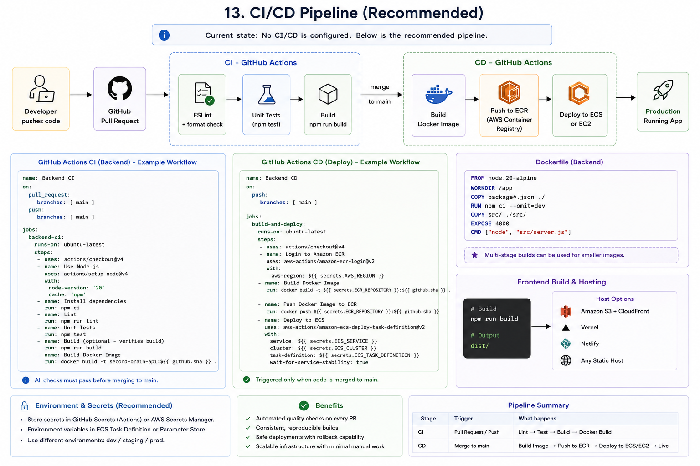
> **Current state:** No CI/CD is configured. Below is the recommended pipeline.

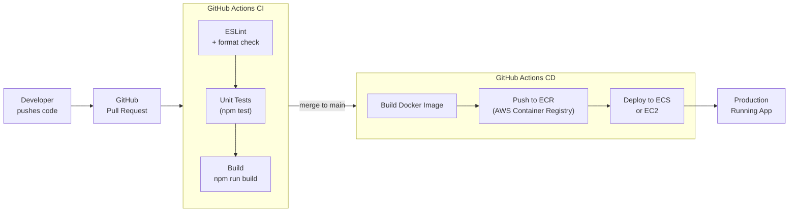

**Recommended GitHub Actions steps for backend:**
```yaml
# .github/workflows/ci.yml
- run: npm ci
- run: npm run lint
- run: npm test
- run: docker build -t second-brain-api .
```

**Recommended Dockerfile for backend:**
```dockerfile
FROM node:20-alpine
WORKDIR /app
COPY package*.json ./
RUN npm ci --omit=dev
COPY src/ ./src/
EXPOSE 4000
CMD ["node", "src/server.js"]
```

**Frontend build:** `npm run build` outputs a `dist/` folder that can be hosted on S3 + CloudFront or any static host (Vercel, Netlify).

---

## 14. Scalability & Security

### Scalability

| Concern | Current | Recommended Improvement |
|---|---|---|
| API & Worker in same process | Fine for dev/low traffic | Split into separate services with independent scaling |
| No caching | Every chat hits OpenAI + Weaviate | Cache embeddings for repeated queries (Redis) |
| Single Weaviate node | Fine locally | Weaviate Cloud or multi-node cluster for production |
| Frontend polling (5s interval) | Simple but wasteful | Replace with WebSockets or Server-Sent Events |
| Chunking is basic (word-based) | Works but not optimal | Use semantic/sentence-aware chunking (LangChain splitter) |

### Security

| Area | Current Implementation | Notes |
|---|---|---|
| Passwords | bcrypt (salt=10) | Secure — plaintext never stored |
| Token | JWT, 7-day expiry, `Bearer` scheme | Production: use refresh tokens, shorter expiry |
| Token storage | `localStorage` | Vulnerable to XSS — production: `httpOnly` cookie |
| User data isolation | All Weaviate queries filter by `user_id` | Users can only see their own document chunks |
| File upload | 50MB limit, memory storage | Production: stream directly to S3, validate MIME types strictly |
| CORS | Hardcoded `localhost:5173` | Set `CORS_ORIGIN` env var for production domain |
| Secrets | `.env` file gitignored | Production: use AWS Secrets Manager or environment injection |
| HTTPS | Not configured | Add TLS termination at load balancer level |

---

## 15. Engineering Decisions & Trade-offs

### Decision 1: Single process for API + Worker
**Why:** Simpler local development — one `npm run dev` command starts everything.
**Trade-off:** Can't scale API and worker independently. Worker errors could crash the API.
**Production fix:** Run two separate containers from the same image, one with `node src/server.js` (API only) and one with `node src/worker.js` (worker only).

### Decision 2: Agentic function-calling instead of hardcoded RAG
**Why:** The LLM decides *when* to search. This means it can answer conversational questions (e.g., "Hello!") without triggering a vector search, and it can choose a better search query than the raw user input.
**Trade-off:** Two LLM calls per search (one to decide + one to answer), plus the reranker call — adds latency (~2–4 seconds).

### Decision 3: Hybrid reranking (LLM + vector score)
**Why:** Pure vector similarity returns semantically similar but sometimes off-topic chunks. The LLM reranker reads both query and chunk together (cross-encoder style) and scores relevance precisely.
**Trade-off:** Costs additional OpenAI tokens per query. Formula: 70% LLM score + 30% vector score.

### Decision 4: Query rewriting before embedding
**Why:** Short, conversational queries ("what does it say about AI?") produce weak embeddings. Rewriting to a verbose, keyword-rich description improves vector search recall significantly.
**Trade-off:** Extra LLM call adds ~300ms latency.

### Decision 5: Weaviate vectors stored explicitly (not auto-vectorized)
**Why:** The OpenAI embedding is generated by the worker at index time and passed directly to Weaviate. This decouples the embedding model from Weaviate's built-in vectorizer module.
**Trade-off:** The worker must generate embeddings before writing to Weaviate — can't batch writes easily.

### Decision 6: Mock fallbacks for all AWS and OpenAI services
**Why:** The app can be run and demoed locally without any cloud credentials. S3 upload failures return a dummy key; SQS failures return a mock ID; OpenAI absence returns a static mock response.
**Trade-off:** Silently degraded functionality can confuse developers if they don't read the warnings in the console.

---

## Quick Start Reference

```bash
# 1. Start databases
docker compose up -d

# 2. Backend
cd backend
cp .env.example .env     # fill in real keys for full functionality
npm install
npm run dev              # starts on :4000

# 3. Frontend (new terminal)
cd frontend
npm install
npm run dev              # starts on :5173
```

Navigate to `http://localhost:5173` — create an account, upload a PDF, and chat.
// flow of the application
